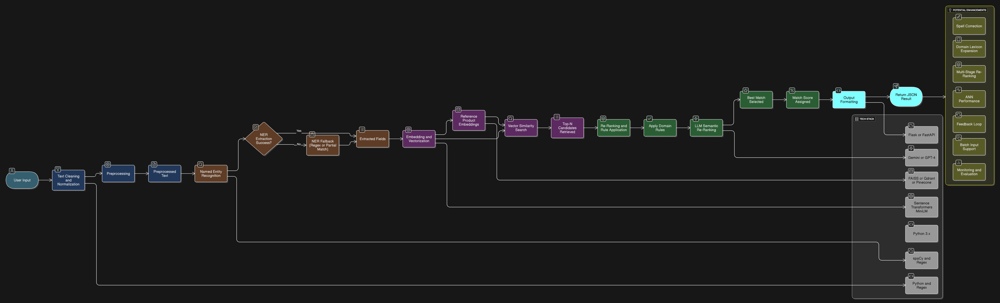

This repository contains two complete projects addressing key business challenges in retail demand forecasting and Arabic product name matching.

✅ Task 1: Sales Forecasting System
Forecast daily product sales for the next 30 days using machine learning and deep learning models to support inventory and demand planning decisions.

Key Features:

Models: XGBoost, LightGBM, LSTM

Data: 12 months of historical sales per product

Feature Engineering: Lag features, rolling statistics, calendar features, days since last sale

Evaluation Metrics: MAPE, RMSE, WMAPE

Output: 30-day product sales forecasts in CSV format

📈 Objective: Improve short-term demand planning for retail operations.

✅ Task 2: Arabic Product Matching System
A production-grade system for matching noisy Arabic product inputs to a structured product database (~30K products) with high accuracy and speed.

Key Features:

Modular NLP Pipeline:

Text Cleaning & Normalization

Named Entity Recognition (NER) using spaCy + Regex

Embedding with Sentence Transformers (MiniLM)

Vector Similarity Search with FAISS / Qdrant / Pinecone

Re-Ranking with domain rules and LLM-based re-ranking (Gemini or GPT-4)

Fast JSON API response via Flask/FastAPI

Scalable, production-ready architecture

Supports batch input, real-time search, and explainable match scores

🛍️ Objective: Deliver robust Arabic product matching for e-commerce, healthcare, and retail applications.

🚀 Tech Stack:
Python 3.x, Flask / FastAPI

XGBoost, LightGBM, LSTM

spaCy, Regex, Sentence Transformers (MiniLM)

FAISS, Qdrant, Pinecone

LLMs: GPT-4, Gemini

Evaluation: MAPE, RMSE, WMAPE, Match Scores

🌟 Potential Future Enhancements:
📊 Forecasting: External features (prices, holidays), hierarchical models, uncertainty estimation

🧠 Matching: Spell correction, domain lexicon, advanced re-ranking, feedback loops, monitoring dashboards

🎁 Status: Research-grade completed prototypes ready for scaling and production.

# Arabic Product Matching System

